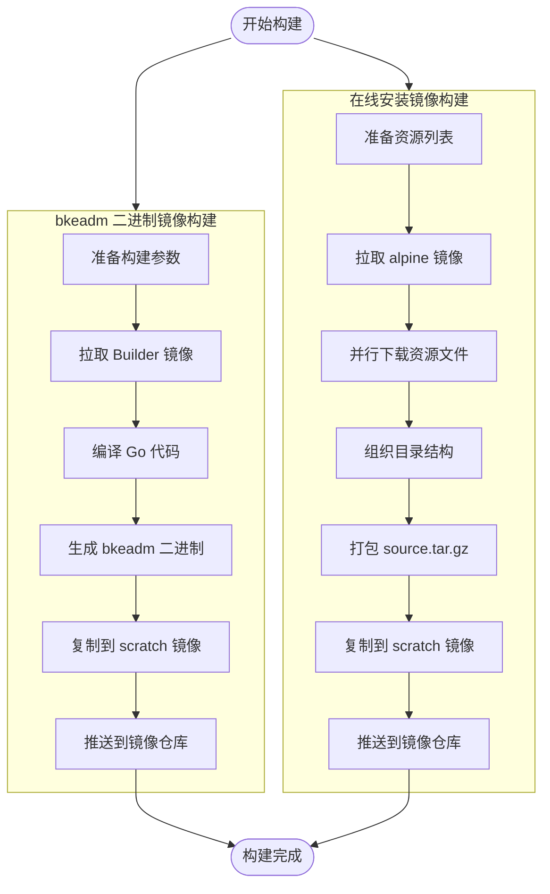

## ONBUILD 镜像
在 Dockerfile 里提到的 **ONBUILD 镜像**，其实是一种特殊的镜像构建机制。它允许你在镜像里预定义一些 **“触发指令”**，这些指令不会在当前镜像构建时执行，而是在 **该镜像被用作基础镜像时**才会自动执行。
### 🛠️ ONBUILD 的作用
- **延迟执行**：ONBUILD 指令在当前镜像构建时不会运行，而是在后续 `FROM` 这个镜像的 Dockerfile 中触发。  
- **常见用途**：  
  - 基础镜像里预设 `ONBUILD COPY . /src` 和 `ONBUILD RUN go build`，这样任何基于它的应用镜像都会自动复制源码并编译。  
  - 适合做“模板镜像”，比如 Go、Node.js、Python 的构建基础镜像。
### ✅ 示例：Go ONBUILD 镜像
```dockerfile
# 基础构建镜像
FROM golang:1.24 AS base

# 定义 ONBUILD 指令
ONBUILD WORKDIR /app
ONBUILD COPY . .
ONBUILD RUN go build -o /go/bin/app -ldflags "$GOLDFLAGS" .
```

这样，当你写一个新的 Dockerfile：
```dockerfile
FROM base AS build
```
就会自动执行：
- 进入 `/app`
- 复制当前目录源码
- 执行 `go build`
### 🎯 总结
- **ONBUILD 镜像**就是在镜像里预定义构建步骤，只有在被继承时才触发。  
- 适合做通用的“构建模板”，比如自动编译 Go 应用。  
- 在你之前的 Dockerfile 里没有 `RUN go build`，如果你想让它自动编译，可以在 Builder 镜像里加上 `ONBUILD RUN go build`。  

# 镜像构建
## ONBUILD 机制解析
### 关键点
bkeadm 的 Dockerfile 使用了：
```dockerfile
ARG BUILDER_IMAGE=cr.openfuyao.cn/openfuyao/builder/$BUILDER:$BUILDER_VERSION
FROM $BUILDER_IMAGE AS build
```
这个 `builder/golang:1.24.5` 镜像是一个 **ONBUILD 镜像**，它在镜像定义中包含了延迟执行的指令。
### ONBUILD 镜像的工作原理
`golang:onbuild` 或类似的 builder 镜像内部定义了：
```dockerfile
# builder 镜像内部的 Dockerfile
FROM golang:1.24.5

# 这些 ONBUILD 指令在子镜像构建时才会执行
ONBUILD COPY . /go/src/app
ONBUILD WORKDIR /go/src/app
ONBUILD RUN go install -v ./...
```
### 构建流程
```
┌─────────────────────────────────────────────────────────────────────────────────────┐
│                              ONBUILD 构建流程                                        │
├─────────────────────────────────────────────────────────────────────────────────────┤
│                                                                                     │
│  Step 1: docker build 使用 bkeadm/Dockerfile                                        │
│          │                                                                          │
│          ▼                                                                          │
│  Step 2: FROM cr.openfuyao.cn/openfuyao/builder/golang:1.24.5 AS build              │
│          │                                                                          │
│          │  ┌─────────────────────────────────────────────────────────────────────┐ │
│          │  │ builder 镜像内部的 ONBUILD 指令被触发:                               │ │
│          │  │                                                                     │ │
│          │  │  ONBUILD COPY . /go/src/app         ← 复制源代码                    │ │
│          │  │  ONBUILD WORKDIR /go/src/app        ← 设置工作目录                  │ │
│          │  │  ONBUILD RUN go install -v ./...    ← 自动执行 go build             │ │
│          │  │                                                                     │ │
│          │  │  编译参数通过 ARG 传入:                                              │ │
│          │  │  - GOFLAGS (编译标签)                                               │ │
│          │  │  - GOLDFLAGS (版本信息注入)                                         │ │
│          │  └─────────────────────────────────────────────────────────────────────┘ │
│          │                                                                          │
│          ▼                                                                          │
│  Step 3: 编译完成，生成 /go/bin/app                                                  │
│          │                                                                          │
│          ▼                                                                          │
│  Step 4: FROM scratch AS release                                                    │
│          COPY --from=build /go/bin/app ./bkeadm                                     │
│                                                                                     │
└─────────────────────────────────────────────────────────────────────────────────────┘
```
### 对比：显式构建 vs ONBUILD
#### 显式构建方式
```dockerfile
FROM golang:1.24.5 AS build
WORKDIR /app
COPY go.mod go.sum ./
RUN go mod download
COPY . .
RUN CGO_ENABLED=0 go build -o /go/bin/app .

FROM scratch AS release
COPY --from=build /go/bin/app ./bkeadm
```
#### ONBUILD 方式
```dockerfile
ARG BUILDER_IMAGE=cr.openfuyao.cn/openfuyao/builder/golang:1.24.5
FROM $BUILDER_IMAGE AS build

FROM scratch AS release
COPY --from=build /go/bin/app ./bkeadm
```
### 参数传递机制
构建参数通过 `ARG` 传递给 ONBUILD 构建过程：
```dockerfile
# 定义构建参数
ARG COMMIT
ARG VERSION
ARG TARGETPLATFORM
ARG SOURCE_DATE_EPOCH
ARG GOFLAGS='-tags=osusergo,netgo,remote,...'
ARG GOLDFLAGS="-X gopkg.openfuyao.cn/bkeadm/utils/version.GitCommitID=$COMMIT ..."

# 这些参数会被 ONBUILD RUN go install 使用
FROM $BUILDER_IMAGE AS build
```
### 构建命令示例
```bash
docker buildx build . -f build/Dockerfile \
    --platform=linux/amd64,linux/arm64 \
    --build-arg=COMMIT=$(git rev-parse HEAD) \
    --build-arg=VERSION=v1.0.0 \
    --build-arg=SOURCE_DATE_EPOCH=$(date +%s) \
    -t cr.openfuyao.cn/openfuyao/bkeadm:v1.0.0
```
### ONBUILD 的优缺点
| 优点 | 缺点 |
|------|------|
| Dockerfile 简洁 | 构建过程不透明 |
| 统一构建标准 | 调试困难 |
| 减少重复代码 | 灵活性降低 |
| 版本一致性 | 依赖 builder 镜像维护 |
### 总结
**`go build` 是在 builder 镜像的 `ONBUILD` 指令中自动执行的**，而不是在 bkeadm 的 Dockerfile 中显式定义。这种设计模式使得 Dockerfile 非常简洁，但需要理解 ONBUILD 机制才能明白构建过程。
        
# bkeadm Docker 镜像构建设计
## 一、概述
bkeadm 提供两种类型的 Docker 镜像构建：

| 镜像类型 | Dockerfile | 用途 | 大小 |
|----------|------------|------|------|
| **bkeadm 二进制镜像** | `Dockerfile` | 包含 bkeadm CLI 工具 | ~30MB |
| **在线安装镜像** | `Dockerfile.online` | 包含完整离线资源 | ~2GB+ |
## 二、镜像架构
```
┌─────────────────────────────────────────────────────────────────────────────────────┐
│                              bkeadm 镜像构建架构                                     │
├─────────────────────────────────────────────────────────────────────────────────────┤
│                                                                                     │
│  ┌─────────────────────────────────────────────────────────────────────────────┐   │
│  │                        镜像类型一: bkeadm 二进制镜像                          │   │
│  │                                                                             │   │
│  │   ┌───────────────┐      ┌───────────────┐      ┌───────────────┐          │   │
│  │   │ Builder Stage │      │ Build Stage   │      │ Release Stage │          │   │
│  │   │ (golang:1.24) │ ───▶ │ 编译 Go 代码   │ ───▶ │ (scratch)     │          │   │
│  │   │               │      │               │      │ 仅含 bkeadm   │          │   │
│  │   └───────────────┘      └───────────────┘      └───────────────┘          │   │
│  │                                                                             │   │
│  │   输出: cr.openfuyao.cn/openfuyao/bkeadm:v1.0.0 (~30MB)                     │   │
│  └─────────────────────────────────────────────────────────────────────────────┘   │
│                                                                                     │
│  ┌─────────────────────────────────────────────────────────────────────────────┐   │
│  │                        镜像类型二: 在线安装镜像                               │   │
│  │                                                                             │   │
│  │   ┌───────────────┐      ┌───────────────┐      ┌───────────────┐          │   │
│  │   │ Builder Stage │      │ Download Stage│      │ Release Stage │          │   │
│  │   │ (alpine:3.18) │ ───▶ │ 下载所有资源   │ ───▶ │ (scratch)     │          │   │
│  │   │               │      │ 打包 source    │      │ 含 source.tar │          │   │
│  │   └───────────────┘      └───────────────┘      └───────────────┘          │   │
│  │                                                                             │   │
│  │   输出: cr.openfuyao.cn/openfuyao/bke-online:v1.0.0 (~2GB+)                 │   │
│  └─────────────────────────────────────────────────────────────────────────────┘   │
│                                                                                     │
└─────────────────────────────────────────────────────────────────────────────────────┘
```
## 三、bkeadm 二进制镜像设计
### 3.1 Dockerfile 分析
```dockerfile
# syntax=docker/dockerfile:latest

# 构建参数定义
ARG BUILDER=golang
ARG BUILDER_VERSION=1.24.5
ARG BUILDER_IMAGE=cr.openfuyao.cn/openfuyao/builder/$BUILDER:$BUILDER_VERSION

# 版本信息参数
ARG COMMIT
ARG VERSION
ARG TARGETPLATFORM
ARG SOURCE_DATE_EPOCH

# Go 编译参数
ARG GOFLAGS='-tags=osusergo,netgo,remote,exclude_graphdriver_btrfs,btrfs_noversion,exclude_graphdriver_devicemapper,containers_image_openpgp'
ARG GOLDFLAGS="-X gopkg.openfuyao.cn/bkeadm/utils/version.GitCommitID=$COMMIT \
               -X gopkg.openfuyao.cn/bkeadm/utils/version.Version=$VERSION \
               -X gopkg.openfuyao.cn/bkeadm/utils/version.Architecture=$TARGETPLATFORM \
               -X gopkg.openfuyao.cn/bkeadm/utils/version.Timestamp=$SOURCE_DATE_EPOCH"

# 构建阶段
FROM $BUILDER_IMAGE AS build

# 发布阶段 - 使用 scratch 最小化镜像
FROM scratch AS release
COPY --link --from=build --chmod=555 /go/bin/app ./bkeadm
ENTRYPOINT ["/bkeadm"]
```
### 3.2 构建参数说明
| 参数 | 说明 | 示例 |
|------|------|------|
| `BUILDER` | 基础构建镜像 | `golang` |
| `BUILDER_VERSION` | Go 版本 | `1.24.5` |
| `COMMIT` | Git Commit ID | `abc123` |
| `VERSION` | 版本号 | `v1.0.0` |
| `TARGETPLATFORM` | 目标平台 | `linux/amd64` |
| `SOURCE_DATE_EPOCH` | 构建时间戳 | `1704067200` |
### 3.3 Go 编译标签说明
```bash
GOFLAGS='-tags=osusergo,netgo,remote,exclude_graphdriver_btrfs,btrfs_noversion,exclude_graphdriver_devicemapper,containers_image_openpgp'
```
| 标签 | 作用 |
|------|------|
| `osusergo` | 使用纯 Go 实现用户/组查找 |
| `netgo` | 使用纯 Go 网络库 |
| `remote` | 启用远程镜像支持 |
| `exclude_graphdriver_btrfs` | 排除 btrfs 存储驱动 |
| `exclude_graphdriver_devicemapper` | 排除 devicemapper 存储驱动 |
| `containers_image_openpgp` | 使用 OpenPGP 签名验证 |
### 3.4 版本信息注入
```go
// 通过 ldflags 注入版本信息
var (
    GitCommitID  string
    Version      string
    Architecture string
    Timestamp    string
)
```
## 四、在线安装镜像设计
### 4.1 Dockerfile.online 分析
```dockerfile
# 第一阶段：下载资源
FROM alpine:3.18 AS builder

WORKDIR /build

# 安装必要工具
RUN apk add curl tar gzip

# 下载 RPM 包
RUN curl -L -o rpm.tar.gz https://openfuyao.obs.cn-north-4.myhuaweicloud.com/rpm/releases/download/v0.0.1/rpm.tar.gz && \
    tar -xzf rpm.tar.gz -C tmp --no-same-owner && \
    rm rpm.tar.gz

# 下载 Kubernetes 组件
RUN curl -L -o kubectl-v1.34.3-of.1-arm64 https://.../kubectl && \
    curl -L -o kubelet-v1.34.3-of.1-arm64 https://.../kubelet && \
    curl -L -o kubelet-v1.34.3-of.1-amd64 https://.../kubelet

# 下载 Containerd
RUN curl -L -o containerd-v2.1.1-linux-amd64.tar.gz https://.../containerd-*.tar.gz

# 下载 CNI 插件
RUN curl -L -o cni-plugins-linux-amd64-v1.4.1.tgz https://.../cni-plugins-*.tgz

# 下载 Helm
RUN curl -L -o helm-v3.14.2-linux-amd64.tar.gz https://.../helm-*.tar.gz

# 下载工具
RUN curl -L -o yq_linux_amd64 https://.../yq_linux_amd64 && \
    curl -L -o jq-linux-amd64 https://.../jq-linux-amd64

# 下载证书工具
RUN curl -L -o cfssl_1.6.4_linux_amd64 https://.../cfssl && \
    curl -L -o cfssljson_1.6.4_linux_amd64 https://.../cfssljson

# 下载 etcdctl
RUN curl -L -o etcdctl-v3.5.6-linux-amd64 https://.../etcdctl

# 下载 Charts
RUN curl -L -o charts.tar.gz https://.../charts.tar.gz

# 组织目录结构
RUN mkdir -p source/files && \
    mv tmp/* source/ && \
    mv kubectl-* source/files/ && \
    mv kubelet-* source/files/ && \
    ...

# 打包
RUN tar -czf source.tar.gz -C source .

# 第二阶段：最终镜像
FROM scratch
COPY --from=builder /build/source.tar.gz /bkesource/source.tar.gz
```
### 4.2 资源清单
```
source.tar.gz
├── files/
│   ├── kubectl-v1.34.3-of.1-amd64      # Kubectl (amd64)
│   ├── kubectl-v1.34.3-of.1-arm64      # Kubectl (arm64)
│   ├── kubelet-v1.34.3-of.1-amd64      # Kubelet (amd64)
│   ├── kubelet-v1.34.3-of.1-arm64      # Kubelet (arm64)
│   ├── containerd-v2.1.1-linux-amd64.tar.gz
│   ├── containerd-v2.1.1-linux-arm64.tar.gz
│   ├── cni-plugins-linux-amd64-v1.4.1.tgz
│   ├── cni-plugins-linux-arm64-v1.4.1.tgz
│   ├── helm-v3.14.2-linux-amd64.tar.gz
│   ├── helm-v3.14.2-linux-arm64.tar.gz
│   ├── yq_linux_amd64                   # YAML 处理工具
│   ├── yq_linux_arm64
│   ├── jq-linux-amd64                   # JSON 处理工具
│   ├── jq-linux-arm64
│   ├── cfssl_1.6.4_linux_amd64          # 证书工具
│   ├── cfssl_1.6.4_linux_arm64
│   ├── cfssljson_1.6.4_linux_amd64
│   ├── cfssljson_1.6.4_linux_arm64
│   ├── cfssl-certinfo_1.6.4_linux_amd64
│   ├── cfssl-certinfo_1.6.4_linux_arm64
│   ├── runc-amd64                       # 容器运行时
│   ├── runc-arm64
│   ├── etcdctl-v3.5.6-linux-amd64       # Etcd 客户端
│   ├── etcdctl-v3.5.6-linux-arm64
│   ├── charts.tar.gz                    # Helm Charts
│   └── nfsshare.tar.gz                  # NFS 共享
└── rpm/
    ├── centos/
    │   ├── 7/amd64/
    │   └── 8/amd64/
    └── ubuntu/
        └── 20.04/amd64/
```
## 五、构建流程
### 5.1 构建流程图

### 5.2 构建命令
#### 构建 bkeadm 二进制镜像
```bash
# 单架构构建
docker buildx build . -f build/Dockerfile \
    -o type=image,name=cr.openfuyao.cn/openfuyao/bkeadm:v1.0.0,push=true \
    --platform=linux/amd64 \
    --build-arg=COMMIT=$(git rev-parse HEAD) \
    --build-arg=VERSION=v1.0.0 \
    --build-arg=SOURCE_DATE_EPOCH=$(git log -1 --pretty=%ct)

# 多架构构建
docker buildx build . -f build/Dockerfile \
    -o type=image,name=cr.openfuyao.cn/openfuyao/bkeadm:v1.0.0,push=true \
    --platform=linux/amd64,linux/arm64 \
    --provenance=false \
    --build-arg=COMMIT=$(git rev-parse HEAD) \
    --build-arg=VERSION=v1.0.0 \
    --build-arg=SOURCE_DATE_EPOCH=$(git log -1 --pretty=%ct)
```
#### 构建在线安装镜像
```bash
# 构建在线安装镜像
docker buildx build . -f build/Dockerfile.online \
    -o type=image,name=cr.openfuyao.cn/openfuyao/bke-online:v1.0.0,push=true \
    --platform=linux/amd64,linux/arm64 \
    --provenance=false
```
## 六、Makefile 构建
### 6.1 Makefile 结构
```makefile
# 版本信息
GOLANG=1.19.x
ARCH ?= linux/amd64,linux/arm64
version = "v1.0.0"
COMMIT_ID ?= $(shell git rev-parse HEAD)

# ldflags
LDFLAGS = -s -w \
    -X main.gitCommitId=$(COMMIT_ID) \
    -X main.architecture=$(shell go env GOHOSTOS)/$(shell go env GOHOSTARCH) \
    -X main.timestamp=$(timestamp) \
    -X main.ver=$(version)

# 目标
.PHONY: build
build:
    @go build -ldflags="$(LDFLAGS)" -o bin/bke .

.PHONY: docker-build
docker-build:
    CGO_ENABLED=0 GOARCH=$(ARCH) go build \
        -tags "remote exclude_graphdriver_btrfs btrfs_noversion exclude_graphdriver_devicemapper containers_image_openpgp" \
        -ldflags "$(LDFLAGS)" \
        -o bin/bke_$(ARCH) .

.PHONY: buildx
buildx:
    @docker run --privileged --rm tonistiigi/binfmt --install all
    @docker buildx create --use --name mybuilder
    @docker buildx inspect mybuilder --bootstrap

.PHONY: docker
docker:
    @docker build -t registry.cn-hangzhou.aliyuncs.com/bocloud/bkeadm:latest .
    @docker push registry.cn-hangzhou.aliyuncs.com/bocloud/bkeadm:latest
```
### 6.2 常用构建命令
```bash
# 本地编译
make build

# 多架构编译
make release

# Docker 构建
make docker

# 设置 buildx 多架构支持
make buildx
```
## 七、镜像使用场景
### 7.1 bkeadm 二进制镜像
```bash
# 提取 bkeadm 二进制
docker create --name bkeadm cr.openfuyao.cn/openfuyao/bkeadm:v1.0.0
docker cp bkeadm:/bkeadm ./bkeadm
docker rm bkeadm

# 直接运行
docker run --rm -v $(pwd):/workspace cr.openfuyao.cn/openfuyao/bkeadm:v1.0.0 version
```
### 7.2 在线安装镜像
```bash
# 提取安装资源
docker create --name bke-source cr.openfuyao.cn/openfuyao/bke-online:v1.0.0
docker cp bke-source:/bkesource/source.tar.gz ./source.tar.gz
docker rm bke-source

# 解压使用
tar -xzf source.tar.gz
```
## 八、多架构支持
### 8.1 支持的架构
| 架构 | 说明 |
|------|------|
| `linux/amd64` | x86_64 架构 (主流服务器) |
| `linux/arm64` | ARM64 架构 (国产化服务器) |
### 8.2 多架构构建配置
```bash
# 安装 QEMU 模拟器
docker run --privileged --rm tonistiigi/binfmt --install all

# 创建 buildx 构建器
docker buildx create --use --name mybuilder
docker buildx inspect mybuilder --bootstrap

# 验证构建器支持的平台
docker buildx inspect --bootstrap
```
## 九、镜像优化策略
### 9.1 当前优化措施
| 优化项 | 方法 | 效果 |
|--------|------|------|
| 最小化基础镜像 | 使用 `scratch` | 镜像大小 ~30MB |
| 静态编译 | `CGO_ENABLED=0` | 无动态依赖 |
| 去除调试信息 | `-ldflags="-s -w"` | 减小二进制大小 |
| 多阶段构建 | Builder + Release | 仅保留必要文件 |
### 9.2 构建缓存优化
```dockerfile
# 利用构建缓存 - 先复制 go.mod
COPY go.mod go.sum ./
RUN go mod download

# 再复制源代码
COPY . .
RUN go build -o /go/bin/app
```
## 十、CI/CD 集成
### 10.1 GitHub Actions 示例
```yaml
name: Build and Push Image

on:
  push:
    tags:
      - 'v*'

jobs:
  build:
    runs-on: ubuntu-latest
    steps:
      - uses: actions/checkout@v4

      - name: Set up QEMU
        uses: docker/setup-qemu-action@v3

      - name: Set up Docker Buildx
        uses: docker/setup-buildx-action@v3

      - name: Login to Registry
        uses: docker/login-action@v3
        with:
          registry: cr.openfuyao.cn
          username: ${{ secrets.REGISTRY_USER }}
          password: ${{ secrets.REGISTRY_PASSWORD }}

      - name: Build and Push
        uses: docker/build-push-action@v5
        with:
          context: .
          file: build/Dockerfile
          platforms: linux/amd64,linux/arm64
          push: true
          tags: |
            cr.openfuyao.cn/openfuyao/bkeadm:${{ github.ref_name }}
            cr.openfuyao.cn/openfuyao/bkeadm:latest
          build-args: |
            COMMIT=${{ github.sha }}
            VERSION=${{ github.ref_name }}
            SOURCE_DATE_EPOCH=${{ github.event.head_commit.timestamp }}
```
## 十一、总结
| 维度 | bkeadm 二进制镜像 | 在线安装镜像 |
|------|-------------------|--------------|
| **基础镜像** | scratch | scratch |
| **构建基础** | golang:1.24.5 | alpine:3.18 |
| **内容** | bkeadm 二进制 | 完整离线资源包 |
| **大小** | ~30MB | ~2GB+ |
| **用途** | CLI 工具分发 | 离线环境部署 |
| **多架构** | amd64, arm64 | amd64, arm64 |

# bkeadm构建命令指南
## 一、本地构建命令
### 1.1 基本构建
```bash
# 构建当前平台的二进制文件
make build

# 或者直接使用go build
go build -ldflags="-s -w \
  -X main.gitCommitId=$(git rev-parse HEAD) \
  -X main.architecture=$(go env GOHOSTOS)/$(go env GOHOSTARCH) \
  -X main.timestamp=$(date "+%Y-%m-%d") \
  -X main.ver=v1.0.0" \
  -o bin/bke .
```
### 1.2 多架构构建
```bash
# 构建amd64和arm64架构的二进制文件
make release

# 或者单独构建特定架构
make docker-build ARCH=amd64
make docker-build ARCH=arm64
```
### 1.3 测试构建
```bash
# 运行测试
make test

# 或者
go test .
```
### 1.4 清理构建产物
```bash
# 清理所有构建产物
make clean
```
## 二、Docker构建命令
### 2.1 构建Docker镜像
```bash
# 构建并推送Docker镜像
make docker

# 或者手动构建
docker build -t registry.cn-hangzhou.aliyuncs.com/bocloud/bkeadm:latest .
docker push registry.cn-hangzhou.aliyuncs.com/bocloud/bkeadm:latest
```
### 2.2 使用Docker容器构建二进制
```bash
# 使用Docker容器构建amd64架构
ARCH=amd64 COMMIT_ID=$(git rev-parse HEAD) VERSION=v1.0.0 TIMESTAMP=$(date "+%Y-%m-%d") \
  build/run-in-docker.sh build/build.sh

# 使用Docker容器构建arm64架构
ARCH=arm64 COMMIT_ID=$(git rev-parse HEAD) VERSION=v1.0.0 TIMESTAMP=$(date "+%Y-%m-%d") \
  build/run-in-docker.sh build/build.sh
```
### 2.3 多架构Docker镜像构建
```bash
# 初始化buildx环境
make buildx

# 构建多架构镜像
docker buildx build \
  --platform linux/amd64,linux/arm64 \
  --build-arg COMMIT=$(git rev-parse HEAD) \
  --build-arg VERSION=v1.0.0 \
  --build-arg SOURCE_DATE_EPOCH=$(date +%s) \
  -t registry.cn-hangzhou.aliyuncs.com/bocloud/bkeadm:v1.0.0 \
  --push \
  .
```
## 三、详细构建参数说明
### 3.1 构建参数
| 参数 | 说明 | 默认值 |
|------|------|--------|
| `COMMIT_ID` | Git提交ID | `git rev-parse HEAD` |
| `VERSION` | 版本号 | `v1.0.0` |
| `TIMESTAMP` | 构建时间戳 | `date "+%Y-%m-%d"` |
| `ARCH` | 目标架构 | `amd64` 或 `arm64` |
| `GOLANG` | Go版本 | `1.19.x` |
### 3.2 构建标签
```bash
# 构建时使用的标签
-tags "remote exclude_graphdriver_btrfs btrfs_noversion exclude_graphdriver_devicemapper containers_image_openpgp"
```
### 3.3 链接器参数
```bash
# LDFLAGS参数
-ldflags="-s -w \
  -X main.gitCommitId=<commit-id> \
  -X main.architecture=<os>/<arch> \
  -X main.timestamp=<timestamp> \
  -X main.ver=<version>"
```
## 四、完整构建示例
### 4.1 本地开发构建
```bash
#!/bin/bash
set -e

# 设置构建参数
export COMMIT_ID=$(git rev-parse HEAD)
export VERSION="v1.0.0"
export TIMESTAMP=$(date "+%Y-%m-%d")
export ARCH=$(go env GOARCH)

# 构建二进制
echo "Building bkeadm for ${ARCH}..."
CGO_ENABLED=0 GOARCH=${ARCH} go build \
  -tags "remote exclude_graphdriver_btrfs btrfs_noversion exclude_graphdriver_devicemapper containers_image_openpgp" \
  -ldflags="-s -w \
    -X main.gitCommitId=${COMMIT_ID} \
    -X main.architecture=$(go env GOHOSTOS)/$(go env GOHOSTARCH) \
    -X main.timestamp=${TIMESTAMP} \
    -X main.ver=${VERSION}" \
  -o bin/bke_${ARCH} .

echo "Build completed: bin/bke_${ARCH}"
```
### 4.2 Docker镜像构建
```bash
#!/bin/bash
set -e

# 设置构建参数
export COMMIT=$(git rev-parse HEAD)
export VERSION="v1.0.0"
export SOURCE_DATE_EPOCH=$(date +%s)

# 构建多架构镜像
echo "Building multi-arch Docker image..."
docker buildx build \
  --platform linux/amd64,linux/arm64 \
  --build-arg COMMIT=${COMMIT} \
  --build-arg VERSION=${VERSION} \
  --build-arg SOURCE_DATE_EPOCH=${SOURCE_DATE_EPOCH} \
  -t registry.cn-hangzhou.aliyuncs.com/bocloud/bkeadm:${VERSION} \
  -t registry.cn-hangzhou.aliyuncs.com/bocloud/bkeadm:latest \
  --push \
  .

echo "Docker image pushed: registry.cn-hangzhou.aliyuncs.com/bocloud/bkeadm:${VERSION}"
```
### 4.3 在线安装包构建
```bash
#!/bin/bash
set -e

# 构建在线安装包镜像
echo "Building online installer image..."
docker build \
  -f build/Dockerfile.online \
  -t registry.cn-hangzhou.aliyuncs.com/bocloud/bkeadm-online:latest \
  .

docker push registry.cn-hangzhou.aliyuncs.com/bocloud/bkeadm-online:latest

echo "Online installer image pushed"
```
## 五、构建输出
### 5.1 本地构建输出
```
bin/
├── bke           # 当前平台二进制
├── bke_amd64     # amd64架构二进制
└── bke_arm64     # arm64架构二进制
```
### 5.2 Docker镜像输出
```
registry.cn-hangzhou.aliyuncs.com/bocloud/bkeadm:v1.0.0
registry.cn-hangzhou.aliyuncs.com/bocloud/bkeadm:latest
registry.cn-hangzhou.aliyuncs.com/bocloud/bkeadm-online:latest
```
## 六、常见问题
### 6.1 多架构构建问题
```bash
# 如果遇到多架构构建问题,需要初始化buildx
make buildx

# 或者手动初始化
docker run --privileged --rm tonistiigi/binfmt --uninstall qemu-*
docker run --privileged --rm tonistiigi/binfmt --install all
docker buildx create --use --name mybuilder
docker buildx inspect mybuilder --bootstrap
```
### 6.2 依赖下载问题
```bash
# 设置Go代理
export GOPROXY="https://goproxy.cn,direct"

# 或者使用Docker构建时设置
docker run \
  -e GOPROXY="https://goproxy.cn,direct" \
  ...
```
### 6.3 权限问题
```bash
# 确保输出目录权限正确
mkdir -p bin
chmod 755 bin
```
## 七、CI/CD集成示例
### 7.1 GitLab CI示例
```yaml
# .gitlab-ci.yml
stages:
  - build
  - docker

variables:
  VERSION: "v1.0.0"

build:
  stage: build
  image: golang:1.24.5
  script:
    - make build
  artifacts:
    paths:
      - bin/bke
    expire_in: 1 week

docker:
  stage: docker
  image: docker:latest
  services:
    - docker:dind
  script:
    - docker login -u $REGISTRY_USER -p $REGISTRY_PASSWORD registry.cn-hangzhou.aliyuncs.com
    - docker build -t registry.cn-hangzhou.aliyuncs.com/bocloud/bkeadm:$VERSION .
    - docker push registry.cn-hangzhou.aliyuncs.com/bocloud/bkeadm:$VERSION
  only:
    - main
```
### 7.2 GitHub Actions示例
```yaml
# .github/workflows/build.yml
name: Build

on:
  push:
    branches: [ main ]
  pull_request:
    branches: [ main ]

jobs:
  build:
    runs-on: ubuntu-latest
    steps:
    - uses: actions/checkout@v3
    
    - name: Set up Go
      uses: actions/setup-go@v4
      with:
        go-version: '1.24.5'
    
    - name: Build
      run: make build
    
    - name: Upload artifact
      uses: actions/upload-artifact@v3
      with:
        name: bke
        path: bin/bke

  docker:
    runs-on: ubuntu-latest
    needs: build
    if: github.event_name == 'push'
    steps:
    - uses: actions/checkout@v3
    
    - name: Set up Docker Buildx
      uses: docker/setup-buildx-action@v2
    
    - name: Login to Registry
      uses: docker/login-action@v2
      with:
        registry: registry.cn-hangzhou.aliyuncs.com
        username: ${{ secrets.REGISTRY_USER }}
        password: ${{ secrets.REGISTRY_PASSWORD }}
    
    - name: Build and push
      uses: docker/build-push-action@v4
      with:
        context: .
        platforms: linux/amd64,linux/arm64
        push: true
        tags: |
          registry.cn-hangzhou.aliyuncs.com/bocloud/bkeadm:latest
          registry.cn-hangzhou.aliyuncs.com/bocloud/bkeadm:${{ github.sha }}
        build-args: |
          COMMIT=${{ github.sha }}
          VERSION=v1.0.0
          SOURCE_DATE_EPOCH=${{ github.event.head_commit.timestamp }}
```
## 八、总结
本指南提供了bkeadm的完整构建命令,包括:
1. **本地构建**: 使用Makefile或直接使用go build命令
2. **Docker构建**: 使用Dockerfile和buildx构建多架构镜像
3. **构建参数**: 详细的构建参数说明
4. **CI/CD集成**: GitLab CI和GitHub Actions示例

通过这些命令,您可以轻松构建和部署bkeadm工具。
                
