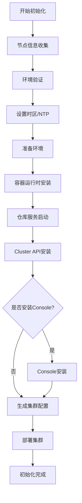
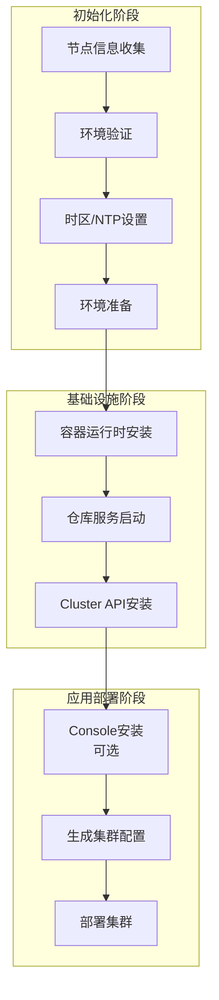

      
# bkeadm init 命令的设计思路
## 一、整体架构设计
### 1. 命令入口与参数解析
**文件**: [cmd/init.go](file:///d:/code/github/bkeadm/cmd/init.go)
```go
var initCmd = &cobra.Command{
    Use:   "init",
    Short: "Initialize the boot node",
    Long:  `Initialize the boot node, including node check, warehouse start, cluster installation, and so on`,
}
```
**参数分类**：

| 类别 | 参数 | 说明 |
|------|------|------|
| **基础配置** | `--hostIP`, `--domain`, `--kubernetesPort` | 节点基础网络配置 |
| **仓库配置** | `--imageRepoPort`, `--yumRepoPort`, `--chartRepoPort` | 本地仓库端口配置 |
| **运行时配置** | `--runtime`, `--runtimeStorage` | 容器运行时选择 |
| **在线安装** | `--onlineImage`, `--otherRepo`, `--otherSource`, `--otherChart` | 在线安装相关参数 |
| **版本控制** | `--clusterAPI`, `--oFVersion`, `--versionUrl` | 组件版本控制 |
| **安全配置** | `--imageRepoTLSVerify`, `--imageRepoCAFile`, `--imageRepoUsername`, `--imageRepoPassword` | TLS认证配置 |
| **功能开关** | `--installConsole`, `--enableNTP` | 可选功能开关 |
## 二、初始化流程设计
### 核心流程（[initialize.go:103-138](file:///d:/code/github/bkeadm/pkg/initialize/initialize.go#L103-L138)）

### 阶段详解
#### **阶段1: 节点信息收集** (`nodeInfo`)
```go
func (op *Options) nodeInfo() {
    h, _ := host.Info()
    c, _ := cpu.Counts(false)
    v, _ := mem.VirtualMemory()
    // 打印主机名、平台、内核、CPU、内存等信息
}
```
#### **阶段2: 环境验证** (`Validate`)
```go
func (op *Options) Validate() error {
    // 1. 解析在线配置
    oc, err = repository.ParseOnlineConfig(...)
    
    // 2. 验证磁盘空间
    if err = op.validateDiskSpace(); err != nil { return err }
    
    // 3. 验证端口占用
    if err = op.validatePorts(); err != nil { return err }
    
    return nil
}
```
#### **阶段3: 时区与NTP设置** (`setTimezone`)
```go
func (op *Options) setTimezone() error {
    // 1. 设置主机时区
    err := timezone.SetTimeZone()
    
    // 2. 配置NTP服务器（如果启用）
    if op.EnableNTP {
        newNTPServer, err := timezone.NTPServer(op.NtpServer, op.HostIP, len(oc.Repo) > 0)
    }
    return nil
}
```
#### **阶段4: 环境准备** (`prepareEnvironment`)
```go
func (op *Options) prepareEnvironment() error {
    // 1. 配置本地源
    op.configLocalSource()
    
    // 2. 设置hosts文件
    syscompat.SetHosts(hostIP, domain)
    
    // 3. 配置私有仓库CA证书
    op.configurePrivateRegistry(clientAuthConfig)
    
    // 4. 初始化仓库（下载源文件、解压等）
    op.initRepositories(clientAuthConfig)
    
    return nil
}
```
#### **阶段5: 容器运行时安装** (`ensureContainerServer`)
```go
func (op *Options) ensureContainerServer() error {
    // 1. 准备仓库依赖（解压镜像包、chart包等）
    repository.PrepareRepositoryDependOn(op.ImageFilePath)
    
    // 2. 验证containerd文件
    result, err := repository.VerifyContainerdFile(op.ImageFilePath)
    
    // 3. 安装运行时
    infrastructure.RuntimeInstall(infrastructure.RuntimeConfig{
        Runtime:        op.Runtime,        // docker 或 containerd
        RuntimeStorage: op.RuntimeStorage,
        Domain:         op.Domain,
        ContainerdFile: containerdFile,
        CniPluginFile:  cniPluginFile,
    })
    
    return nil
}
```
#### **阶段6: 仓库服务启动** (`ensureRepository`)
```go
func (op *Options) ensureRepository() error {
    // 1. 加载本地镜像
    repository.LoadLocalRepository()
    
    // 2. 启动镜像仓库服务
    repository.ContainerServer(op.ImageFilePath, op.ImageRepoPort, oc.Repo, oc.Image)
    
    // 3. 启动YUM仓库服务
    repository.YumServer(op.ImageFilePath, op.ImageRepoPort, op.YumRepoPort, oc.Repo, oc.Image)
    
    // 4. 启动Chart仓库服务
    repository.ChartServer(op.ImageFilePath, op.ImageRepoPort, op.ChartRepoPort, oc.Repo, oc.Image)
    
    // 5. 启动NFS服务（可选）
    repository.NFSServer(op.ImageRepoPort, oc.Repo, oc.Image)
    
    return nil
}
```
#### **阶段7: Cluster API安装** (`ensureClusterAPI`)
```go
func (op *Options) ensureClusterAPI() error {
    // 1. 启动本地Kubernetes（k3s）
    infrastructure.StartLocalKubernetes(k3s.Config{...})
    
    // 2. 生成部署ConfigMap（版本信息）
    op.generateDeployCM()
    
    // 3. 应用containerd配置
    containerd.ApplyContainerdCfg(fmt.Sprintf("%s:%s", op.Domain, op.ImageRepoPort))
    
    // 4. 应用kubelet配置
    kubelet.ApplyKubeletCfg()
    
    // 5. 安装BKEAgent CRD
    bkeagent.InstallBKEAgentCRD()
    
    // 6. 部署Cluster API组件
    clusterapi.DeployClusterAPI(repo, manifestsVersion, providerVersion)
    
    return nil
}
```
#### **阶段8: Console安装** (`ensureConsoleAll`)
```go
func (op *Options) ensureConsoleAll() error {
    if !op.InstallConsole {
        return nil
    }
    
    // 部署BKE Console所有组件
    bkeconsole.DeployConsoleAll(sRestartConfig, repo, op.OFVersion)
    
    return nil
}
```
#### **阶段9: 生成集群配置** (`generateClusterConfig`)
```go
func (op *Options) generateClusterConfig() {
    // 1. 准备配置数据
    data, repo, err := op.prepareClusterConfigData()
    
    // 2. 创建集群配置文件
    op.createClusterConfigFile(data, repo[0], repo[1], repo[2])
    
    // 输出提示信息
    log.BKEFormat(log.HINT, "Run `bke cluster create -f ...` command to deploy the cluster")
}
```
## 三、安装模式设计
### 1. 离线安装模式
```bash
bkeadm init
```
- 使用本地镜像包和源文件
- 启动本地镜像仓库、YUM仓库、Chart仓库
- 所有资源从本地获取
### 2. 在线安装模式
```bash
bkeadm init --onlineImage registry.example.com/openfuyao:v1.0.0
```
- 从远程镜像仓库拉取镜像
- 从远程HTTP服务器下载运行时文件
### 3. 私有仓库模式
```bash
bkeadm init \
  --otherRepo registry.internal.company.com/ \
  --otherSource http://repo.internal.company.com/openfuyao \
  --otherChart chart.internal.company.com/
```
- 使用企业内部私有仓库
- 支持TLS证书认证
### 4. 本地镜像文件模式
```bash
bkeadm init --imageFilePath /path/to/image.tar.gz --otherRepo registry.example.com/
```
- 使用本地镜像文件
- 适用于离线环境快速部署
## 四、参数优先级设计
### 镜像仓库优先级
```go
// 优先级：localImage > otherRepo > onlineImage > 默认值
if localImage != "" {
    image = utils.DefaultLocalImageRegistry
} else if otherRepo != "" {
    image = fmt.Sprintf("%s%s", otherRepo, utils.DefaultLocalImageRegistry)
} else if onlineImage == "" {
    image = utils.DefaultLocalImageRegistry
} else {
    image = fmt.Sprintf("%s/%s", utils.DefaultThirdMirror, utils.DefaultLocalImageRegistry)
}
```
### 仓库路径优先级
```go
// 优先级：ImageFilePath > oc.Repo > (oc.Image为空时使用本地) > 默认值
if op.ImageFilePath != "" {
    repo = localRepoPath
} else if oc.Repo != "" {
    repo = oc.Repo
} else if oc.Image == "" {
    repo = localRepoPath
}
```
## 五、版本管理设计
### 1. 版本配置来源
**离线模式**：从本地patches目录读取
```go
func (op *Options) offlineGenerateDeployCM(patchesDir string) error {
    // 从本地目录读取版本配置文件
    // 生成ConfigMap供后续安装使用
}
```
**在线模式**：从远程下载版本配置
```go
func (op *Options) onlineGenerateDeployCM() error {
    // 从versionUrl下载index.yaml
    // 根据oFVersion下载对应的版本配置文件
    // 生成ConfigMap
}
```
### 2. 版本信息存储
```go
// 存储在ConfigMap中
patchCmKey := fmt.Sprintf("cm.%s", openFuyaoVersion)
patchConfigMap, err := k8sClient.CoreV1().ConfigMaps("openfuyao-patch").Get(...)
```
## 六、安全设计
### 1. TLS证书配置
```go
type CertificateConfig struct {
    TLSVerify    bool
    CAFile       string
    Username     string
    Password     string
    RegistryHost string
    RegistryPort string
}
```
### 2. 证书配置流程
```go
func (op *Options) configurePrivateRegistry(cfg *CertificateConfig) error {
    // 1. 解析仓库地址
    registryHost, registryPort := repository.ParseRegistryHostPort(oc.Repo)
    
    // 2. 配置CA证书
    if cfg.TLSVerify && cfg.CAFile != "" {
        repository.SetupCACertificate(cfg)
    }
    
    return nil
}
```
## 七、设计亮点
### 1. **灵活的安装模式**
- 支持离线、在线、私有仓库、本地镜像文件四种模式
- 参数优先级清晰，易于理解和使用
### 2. **模块化设计**
- 每个阶段独立函数，职责清晰
- 易于测试和维护
### 3. **依赖注入**
```go
type Options struct {
    FS               afero.Fs
    DownloadFunc     func(url, dest string) error
    SetPatchConfigFn func(version, path, key string) error
    K8sClient        k8s.KubernetesClient
}
```
- 支持测试时注入mock对象
- 提高代码可测试性
### 4. **错误处理**
- 每个阶段都有明确的错误处理
- 提供清晰的错误日志
### 5. **版本管理**
- 支持多版本共存
- 通过ConfigMap管理版本配置
- 支持在线和离线版本获取
### 6. **安全默认配置**
- TLS验证默认启用
- 支持CA证书和用户名密码认证
- 私有仓库安全配置
## 八、流程图总结


这种设计确保了初始化过程的**可靠性**、**灵活性**和**可维护性**，同时支持多种部署场景。
        
