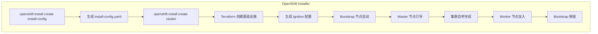
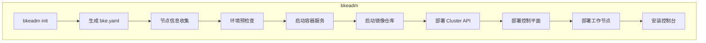

# bkeadm 与 OpenShift installer 在架构上是对应的组件
是的，**bkeadm 与 OpenShift installer 在架构上是对应的组件**。两者都是企业级 Kubernetes 发行版的安装部署工具。让我详细对比分析：
## bkeadm vs OpenShift Installer 架构对比
### 一、定位对比
| 维度 | OpenShift Installer | bkeadm |
|------|---------------------|--------|
| **产品** | Red Hat OpenShift | openFuyao (BKE) |
| **定位** | 企业级 Kubernetes 平台安装器 | 企业级 Kubernetes 平台安装器 |
| **开源地址** | github.com/openshift/installer | 内部仓库 |
### 二、安装模式对比
```
┌─────────────────────────────────────────────────────────────────────────────────────┐
│                              安装模式对比                                            │
├─────────────────────────────────────────────────────────────────────────────────────┤
│                                                                                     │
│  OpenShift Installer                          bkeadm                                │
│  ────────────────────                         ────────                              │
│                                                                                     │
│  ┌─────────────────────────────────┐         ┌─────────────────────────────────┐   │
│  │ IPI (Installer Provisioned)     │         │ 在线安装模式                     │   │
│  │ • 自动创建基础设施               │         │ • 自动拉取镜像                   │   │
│  │ • Terraform 编排                │         │ • 依赖外部镜像仓库               │   │
│  │ • 全自动化部署                   │         │ • 适合有网络环境                 │   │
│  └─────────────────────────────────┘         └─────────────────────────────────┘   │
│                                                                                     │
│  ┌─────────────────────────────────┐         ┌─────────────────────────────────┐   │
│  │ UPI (User Provisioned)          │         │ 离线安装模式                     │   │
│  │ • 用户准备基础设施               │         │ • 预打包所有依赖                 │   │
│  │ • 手动配置网络/存储              │         │ • 本地镜像仓库                   │   │
│  │ • 适合裸机环境                   │         │ • 适合隔离环境                   │   │
│  └─────────────────────────────────┘         └─────────────────────────────────┘   │
│                                                                                     │
└─────────────────────────────────────────────────────────────────────────────────────┘
```
### 三、架构对比
```
┌─────────────────────────────────────────────────────────────────────────────────────┐
│                              架构层级对比                                            │
├─────────────────────────────────────────────────────────────────────────────────────┤
│                                                                                     │
│  层级              OpenShift Installer              bkeadm                          │
│  ─────             ───────────────────              ────────                        │
│                                                                                     │
│  CLI入口           openshift-install                bkeadm                          │
│                    ├── create install-config        ├── init                        │
│                    ├── create cluster               ├── start                       │
│                    ├── destroy cluster              ├── reset                       │
│                    └── gather bootstrap             └── status                      │
│                                                                                     │
│  配置管理          install-config.yaml              bke.yaml                        │
│                    • ClusterNetwork                 • networking                    │
│                    • Compute                        • nodes                         │
│                    • ControlPlane                   • controlPlane                  │
│                    • Platform                       • registry                      │
│                                                                                     │
│  基础设施编排      Terraform                        直接执行                         │
│                    • AWS/Azure/GCP                  • SSH 远程执行                   │
│                    • vSphere/OpenStack              • 本地脚本                       │
│                    • Bare Metal (Libvirt)           • Ansible (可选)                 │
│                                                                                     │
│  节点配置          Ignition                         Cloud-init / 脚本               │
│                    • Fedora CoreOS                  • CentOS/Ubuntu                 │
│                    • 声明式配置                     • 命令式配置                     │
│                                                                                     │
│  集群生命周期      Cluster Version Operator         Cluster API Provider            │
│                    (CVO)                            (CAPBKE)                        │
│                                                                                     │
│  引导机制          Bootstrap 节点                   Bootstrap 节点                   │
│                    • 临时控制平面                   • K3s 临时集群                   │
│                    • 24小时后删除                   • 安装完成后删除                 │
│                                                                                     │
└─────────────────────────────────────────────────────────────────────────────────────┘
```
### 四、核心流程对比
#### OpenShift Installer 流程

#### bkeadm 流程

### 五、技术栈对比
| 技术领域 | OpenShift Installer | bkeadm |
|----------|---------------------|--------|
| **编程语言** | Go | Go |
| **基础设施编排** | Terraform | 直接执行 / Shell |
| **配置格式** | Ignition (JSON) | Cloud-init / Shell |
| **操作系统** | Fedora CoreOS / RHCOS | CentOS / Ubuntu / Kylin |
| **容器运行时** | CRI-O | Docker / Containerd |
| **集群生命周期** | CVO (Cluster Version Operator) | Cluster API + CAPBKE |
| **镜像仓库** | 内置 Registry | Harbor / Docker Registry |
| **负载均衡** | 内置 HAProxy | Keepalived + HAProxy |
### 六、功能对比
| 功能 | OpenShift Installer | bkeadm |
|------|:-------------------:|:------:|
| 集群安装 | ✅ | ✅ |
| 集群升级 | ✅ (CVO) | ✅ (Cluster API) |
| 集群销毁 | ✅ | ✅ |
| 多平台支持 | ✅ (AWS/Azure/GCP/vSphere/Bare Metal) | ✅ (Bare Metal) |
| 离线安装 | ✅ | ✅ |
| 高可用部署 | ✅ | ✅ |
| 节点扩缩容 | ✅ | ✅ |
| 配置验证 | ✅ | ✅ |
| 日志收集 | ✅ (gather) | ⚠️ (部分) |
| 版本管理 | ✅ (ClusterVersion CRD) | ⚠️ (手动) |
### 七、关键差异分析
#### 7.1 基础设施编排
**OpenShift Installer:**
```hcl
# 使用 Terraform 编排基础设施
resource "aws_instance" "master" {
  count         = var.master_count
  ami           = var.ami_id
  instance_type = var.master_instance_type
  
  user_data = data.ignition_config.master.rendered
}
```
**bkeadm:**
```go
// 直接通过 SSH 执行命令
func (o *Options) deployMasterNodes() error {
    for _, node := range o.Config.Nodes {
        err := global.Command.ExecuteCommand("ssh", node.IP, "bash", scriptPath)
        if err != nil {
            return err
        }
    }
    return nil
}
```
#### 7.2 节点配置
**OpenShift Installer (Ignition):**
```json
{
  "ignition": {
    "version": "3.2.0"
  },
  "systemd": {
    "units": [{
      "name": "kubelet.service",
      "enabled": true,
      "contents": "[Unit]\nDescription=Kubelet\n..."
    }]
  },
  "storage": {
    "files": [{
      "path": "/etc/kubernetes/kubelet.conf",
      "contents": {
        "source": "data:,..."
      }
    }]
  }
}
```
**bkeadm (Shell/Cloud-init):**
```bash
#!/bin/bash
# 直接执行配置脚本
systemctl enable kubelet
systemctl start kubelet

cat > /etc/kubernetes/kubelet.conf << EOF
apiVersion: kubelet.config.k8s.io/v1beta1
kind: KubeletConfiguration
...
EOF
```
#### 7.3 集群生命周期管理
**OpenShift Installer (CVO):**
```yaml
apiVersion: config.openshift.io/v1
kind: ClusterVersion
metadata:
  name: version
spec:
  channel: stable-4.14
  desiredUpdate:
    version: 4.14.0
```
**bkeadm (Cluster API):**
```yaml
apiVersion: cluster.x-k8s.io/v1beta1
kind: Cluster
metadata:
  name: bke-cluster
spec:
  clusterNetwork:
    pods:
      cidrBlocks: ["10.244.0.0/16"]
  controlPlaneRef:
    apiVersion: controlplane.cluster.x-k8s.io/v1beta1
    kind: KubeadmControlPlane
    name: bke-control-plane
```
### 八、总结
| 维度 | 结论 |
|------|------|
| **架构定位** | ✅ **对应** - 两者都是企业级 K8s 发行版的安装部署工具 |
| **核心功能** | ✅ **对应** - 都支持集群安装、升级、销毁 |
| **安装模式** | ⚠️ **相似** - 都支持 IPI/UPI 或在线/离线模式 |
| **技术栈** | ⚠️ **差异** - OpenShift 使用 Terraform+Ignition，bkeadm 使用 Shell+Cluster API |
| **平台支持** | ⚠️ **差异** - OpenShift 支持更多云平台，bkeadm 专注裸机 |
| **成熟度** | ⚠️ **差异** - OpenShift 更成熟，bkeadm 正在演进中 |

**结论：bkeadm 是 OpenShift Installer 在 openFuyao 产品中的对应组件，承担相同的职责，但在技术实现上有所不同。**
        
