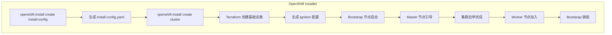
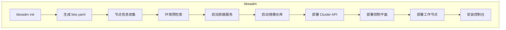

# bkeadm 与 OpenShift installer 在架构上是对应的组件
是的，**bkeadm 与 OpenShift installer 在架构上是对应的组件**。两者都是企业级 Kubernetes 发行版的安装部署工具。让我详细对比分析：
## bkeadm vs OpenShift Installer 架构对比
### 一、定位对比
| 维度 | OpenShift Installer | bkeadm |
|------|---------------------|--------|
| **产品** | Red Hat OpenShift | openFuyao (BKE) |
| **定位** | 企业级 Kubernetes 平台安装器 | 企业级 Kubernetes 平台安装器 |
| **开源地址** | github.com/openshift/installer | 内部仓库 |
### 二、安装模式对比
```
┌─────────────────────────────────────────────────────────────────────────────────────┐
│                              安装模式对比                                            │
├─────────────────────────────────────────────────────────────────────────────────────┤
│                                                                                     │
│  OpenShift Installer                          bkeadm                                │
│  ────────────────────                         ────────                              │
│                                                                                     │
│  ┌─────────────────────────────────┐         ┌─────────────────────────────────┐   │
│  │ IPI (Installer Provisioned)     │         │ 在线安装模式                     │   │
│  │ • 自动创建基础设施               │         │ • 自动拉取镜像                   │   │
│  │ • Terraform 编排                │         │ • 依赖外部镜像仓库               │   │
│  │ • 全自动化部署                   │         │ • 适合有网络环境                 │   │
│  └─────────────────────────────────┘         └─────────────────────────────────┘   │
│                                                                                     │
│  ┌─────────────────────────────────┐         ┌─────────────────────────────────┐   │
│  │ UPI (User Provisioned)          │         │ 离线安装模式                     │   │
│  │ • 用户准备基础设施               │         │ • 预打包所有依赖                 │   │
│  │ • 手动配置网络/存储              │         │ • 本地镜像仓库                   │   │
│  │ • 适合裸机环境                   │         │ • 适合隔离环境                   │   │
│  └─────────────────────────────────┘         └─────────────────────────────────┘   │
│                                                                                     │
└─────────────────────────────────────────────────────────────────────────────────────┘
```
### 三、架构对比
```
┌─────────────────────────────────────────────────────────────────────────────────────┐
│                              架构层级对比                                            │
├─────────────────────────────────────────────────────────────────────────────────────┤
│                                                                                     │
│  层级              OpenShift Installer              bkeadm                          │
│  ─────             ───────────────────              ────────                        │
│                                                                                     │
│  CLI入口           openshift-install                bkeadm                          │
│                    ├── create install-config        ├── init                        │
│                    ├── create cluster               ├── start                       │
│                    ├── destroy cluster              ├── reset                       │
│                    └── gather bootstrap             └── status                      │
│                                                                                     │
│  配置管理          install-config.yaml              bke.yaml                        │
│                    • ClusterNetwork                 • networking                    │
│                    • Compute                        • nodes                         │
│                    • ControlPlane                   • controlPlane                  │
│                    • Platform                       • registry                      │
│                                                                                     │
│  基础设施编排      Terraform                        直接执行                         │
│                    • AWS/Azure/GCP                  • SSH 远程执行                   │
│                    • vSphere/OpenStack              • 本地脚本                       │
│                    • Bare Metal (Libvirt)           • Ansible (可选)                 │
│                                                                                     │
│  节点配置          Ignition                         Cloud-init / 脚本               │
│                    • Fedora CoreOS                  • CentOS/Ubuntu                 │
│                    • 声明式配置                     • 命令式配置                     │
│                                                                                     │
│  集群生命周期      Cluster Version Operator         Cluster API Provider            │
│                    (CVO)                            (CAPBKE)                        │
│                                                                                     │
│  引导机制          Bootstrap 节点                   Bootstrap 节点                   │
│                    • 临时控制平面                   • K3s 临时集群                   │
│                    • 24小时后删除                   • 安装完成后删除                 │
│                                                                                     │
└─────────────────────────────────────────────────────────────────────────────────────┘
```
### 四、核心流程对比
#### OpenShift Installer 流程

#### bkeadm 流程

### 五、技术栈对比
| 技术领域 | OpenShift Installer | bkeadm |
|----------|---------------------|--------|
| **编程语言** | Go | Go |
| **基础设施编排** | Terraform | 直接执行 / Shell |
| **配置格式** | Ignition (JSON) | Cloud-init / Shell |
| **操作系统** | Fedora CoreOS / RHCOS | CentOS / Ubuntu / Kylin |
| **容器运行时** | CRI-O | Docker / Containerd |
| **集群生命周期** | CVO (Cluster Version Operator) | Cluster API + CAPBKE |
| **镜像仓库** | 内置 Registry | Harbor / Docker Registry |
| **负载均衡** | 内置 HAProxy | Keepalived + HAProxy |
### 六、功能对比
| 功能 | OpenShift Installer | bkeadm |
|------|:-------------------:|:------:|
| 集群安装 | ✅ | ✅ |
| 集群升级 | ✅ (CVO) | ✅ (Cluster API) |
| 集群销毁 | ✅ | ✅ |
| 多平台支持 | ✅ (AWS/Azure/GCP/vSphere/Bare Metal) | ✅ (Bare Metal) |
| 离线安装 | ✅ | ✅ |
| 高可用部署 | ✅ | ✅ |
| 节点扩缩容 | ✅ | ✅ |
| 配置验证 | ✅ | ✅ |
| 日志收集 | ✅ (gather) | ⚠️ (部分) |
| 版本管理 | ✅ (ClusterVersion CRD) | ⚠️ (手动) |
### 七、关键差异分析
#### 7.1 基础设施编排
**OpenShift Installer:**
```hcl
# 使用 Terraform 编排基础设施
resource "aws_instance" "master" {
  count         = var.master_count
  ami           = var.ami_id
  instance_type = var.master_instance_type
  
  user_data = data.ignition_config.master.rendered
}
```
**bkeadm:**
```go
// 直接通过 SSH 执行命令
func (o *Options) deployMasterNodes() error {
    for _, node := range o.Config.Nodes {
        err := global.Command.ExecuteCommand("ssh", node.IP, "bash", scriptPath)
        if err != nil {
            return err
        }
    }
    return nil
}
```
#### 7.2 节点配置
**OpenShift Installer (Ignition):**
```json
{
  "ignition": {
    "version": "3.2.0"
  },
  "systemd": {
    "units": [{
      "name": "kubelet.service",
      "enabled": true,
      "contents": "[Unit]\nDescription=Kubelet\n..."
    }]
  },
  "storage": {
    "files": [{
      "path": "/etc/kubernetes/kubelet.conf",
      "contents": {
        "source": "data:,..."
      }
    }]
  }
}
```
**bkeadm (Shell/Cloud-init):**
```bash
#!/bin/bash
# 直接执行配置脚本
systemctl enable kubelet
systemctl start kubelet

cat > /etc/kubernetes/kubelet.conf << EOF
apiVersion: kubelet.config.k8s.io/v1beta1
kind: KubeletConfiguration
...
EOF
```
#### 7.3 集群生命周期管理
**OpenShift Installer (CVO):**
```yaml
apiVersion: config.openshift.io/v1
kind: ClusterVersion
metadata:
  name: version
spec:
  channel: stable-4.14
  desiredUpdate:
    version: 4.14.0
```
**bkeadm (Cluster API):**
```yaml
apiVersion: cluster.x-k8s.io/v1beta1
kind: Cluster
metadata:
  name: bke-cluster
spec:
  clusterNetwork:
    pods:
      cidrBlocks: ["10.244.0.0/16"]
  controlPlaneRef:
    apiVersion: controlplane.cluster.x-k8s.io/v1beta1
    kind: KubeadmControlPlane
    name: bke-control-plane
```
### 八、总结
| 维度 | 结论 |
|------|------|
| **架构定位** | ✅ **对应** - 两者都是企业级 K8s 发行版的安装部署工具 |
| **核心功能** | ✅ **对应** - 都支持集群安装、升级、销毁 |
| **安装模式** | ⚠️ **相似** - 都支持 IPI/UPI 或在线/离线模式 |
| **技术栈** | ⚠️ **差异** - OpenShift 使用 Terraform+Ignition，bkeadm 使用 Shell+Cluster API |
| **平台支持** | ⚠️ **差异** - OpenShift 支持更多云平台，bkeadm 专注裸机 |
| **成熟度** | ⚠️ **差异** - OpenShift 更成熟，bkeadm 正在演进中 |

**结论：bkeadm 是 OpenShift Installer 在 openFuyao 产品中的对应组件，承担相同的职责，但在技术实现上有所不同。**
        

# bkeadm命令作用与规格
## 一、命令概览
bkeadm是Bocloud Enterprise Kubernetes部署工具,提供Kubernetes集群部署、运维、治理的一体化解决方案。
### 1.1 命令结构
```
bke [全局选项] <command> [子命令] [选项]
```
### 1.2 全局选项
| 选项 | 说明 | 默认值 |
|------|------|--------|
| `--kubeconfig` | Kubernetes配置文件路径 | `~/.kube/config` |
| `--doc` | 显示命令文档 | `false` |
## 二、核心命令详解
### 2.1 init - 初始化引导节点
**作用**: 初始化引导节点,包括节点检查、仓库启动、集群安装等

**规格**:
```bash
bke init [选项]
```
**选项**:

| 选项 | 简写 | 默认值 | 说明 |
|------|------|--------|------|
| `--file` | `-f` | - | BKE集群配置文件 |
| `--domain` | - | `bke.bocloud.com` | 主机域名 |
| `--hostIP` | - | 自动获取 | 本地Kubernetes API服务器地址 |
| `--kubernetesPort` | - | `6443` | 本地Kubernetes端口 |
| `--imageRepoPort` | - | `443` | 镜像仓库端口 |
| `--yumRepoPort` | - | `80` | YUM仓库端口 |
| `--chartRepoPort` | - | `443` | Chart仓库端口 |
| `--ntpServer` | - | `local` | NTP服务器地址 |
| `--runtime` | - | `containerd` | 容器运行时 |
| `--runtimeStorage` | `-s` | `/var/lib/containerd` | 运行时存储路径 |
| `--onlineImage` | - | - | 在线安装镜像地址 |
| `--otherRepo` | - | - | 外部镜像仓库地址 |
| `--otherSource` | - | - | 外部YUM源地址 |
| `--otherChart` | - | - | 外部Chart仓库地址 |
| `--clusterAPI` | - | `latest` | Cluster API版本 |
| `--oFVersion` | `-v` | `latest` | OpenFuyao版本 |
| `--versionUrl` | - | 默认URL | 版本配置下载地址 |
| `--installConsole` | - | `true` | 是否安装控制台 |
| `--enableNTP` | - | `true` | 是否启用NTP服务 |
| `--imageRepoTLSVerify` | - | `true` | 镜像仓库TLS验证 |
| `--imageRepoCAFile` | - | - | 镜像仓库CA证书文件 |
| `--imageRepoUsername` | - | - | 镜像仓库用户名 |
| `--imageRepoPassword` | - | - | 镜像仓库密码 |
| `--imageFilePath` | - | - | 本地镜像文件路径 |
| `--agentHealthPort` | - | `8080` | Agent健康检查端口 |
| `--confirm` | - | `false` | 跳过确认提示 |

**示例**:
```bash
# 基本初始化
bke init

# 使用配置文件初始化
bke init --file bkecluster.yaml

# 在线安装模式
bke init --onlineImage cr.openfuyao.cn/openfuyao/bke-online-installed:latest

# 使用外部仓库
bke init --otherRepo cr.openfuyao.cn/openfuyao --otherSource http://192.168.1.120:40080

# 不安装控制台
bke init --installConsole=false
```
### 2.2 build - 构建安装包
**作用**: 构建BKE安装包

**规格**:
```bash
bke build [子命令] [选项]
```
#### 2.2.1 build - 构建离线安装包
```bash
bke build -f bke.yaml -t bke.tar.gz
```
**选项**:

| 选项 | 简写 | 默认值 | 说明 |
|------|------|--------|------|
| `--file` | `-f` | - | 配置文件路径(必需) |
| `--target` | `-t` | - | 输出文件名 |

#### 2.2.2 build config - 导出默认配置
```bash
bke build config
```
**作用**: 导出默认的BKE配置文件
#### 2.2.3 build patch - 构建增量补丁包
```bash
bke build patch -f bke.yaml -t bke-patch.tar.gz
```
**选项**:

| 选项 | 简写 | 默认值 | 说明 |
|------|------|--------|------|
| `--file` | `-f` | - | 配置文件路径(必需) |
| `--target` | `-t` | - | 输出文件名 |
| `--strategy` | `-s` | `registry` | 镜像同步策略 |

#### 2.2.4 build online-image - 构建在线安装镜像
```bash
bke build online-image -f bke.yaml -t cr.openfuyao.cn/openfuyao/bke-online-installed:latest
```
**选项**:

| 选项 | 简写 | 默认值 | 说明 |
|------|------|--------|------|
| `--file` | `-f` | - | 配置文件路径(必需) |
| `--target` | `-t` | - | 目标镜像名(必需) |
| `--arch` | - | 当前架构 | 目标架构 |
#### 2.2.5 build rpm - 构建离线RPM包
```bash
bke build rpm --source rpm --add centos/8/amd64 --package docker-ce
```

**选项**:

| 选项 | 默认值 | 说明 |
|------|--------|------|
| `--source` | - | 源RPM文件路径 |
| `--add` | - | 添加RPM文件路径 |
| `--registry` | `registry.cn-hangzhou.aliyuncs.com/bocloud` | 仓库地址 |
| `--package` | - | 包名 |
#### 2.2.6 build check - 检查配置文件
```bash
bke build check -f bke.yaml
```
**选项**:

| 选项 | 简写 | 默认值 | 说明 |
|------|------|--------|------|
| `--file` | `-f` | - | 配置文件路径(必需) |
| `--only-image` | - | `false` | 仅检查镜像 |
### 2.3 cluster - 集群管理
**作用**: 管理现有集群

**规格**:
```bash
bke cluster [子命令] [选项]
```
#### 2.3.1 cluster list - 列出集群
```bash
bke cluster list
```
**作用**: 获取集群列表
#### 2.3.2 cluster create - 创建集群
```bash
bke cluster create -f bkecluster.yaml -n bkenodes.yaml
```
**选项**:

| 选项 | 简写 | 默认值 | 说明 |
|------|------|--------|------|
| `--file` | `-f` | - | BKE集群配置文件(必需) |
| `--nodes` | `-n` | - | BKE节点配置文件(必需) |
#### 2.3.3 cluster scale - 扩缩容集群
```bash
bke cluster scale -f bkecluster.yaml -n bkenodes.yaml
```
**选项**:

| 选项 | 简写 | 默认值 | 说明 |
|------|------|--------|------|
| `--file` | `-f` | - | BKE集群配置文件(必需) |
| `--nodes` | `-n` | - | BKE节点配置文件(必需) |
#### 2.3.4 cluster remove - 删除集群
```bash
bke cluster remove ns/name
```
**参数**: `ns/name` - 命名空间/集群名
#### 2.3.5 cluster logs - 查看集群日志
```bash
bke cluster logs ns/name
```
**参数**: `ns/name` - 命名空间/集群名

**作用**: 获取集群部署事件
#### 2.3.6 cluster exist - 管理现有集群
```bash
bke cluster exist --conf kubeconfig -f bkecluster.yaml
```
**选项**:

| 选项 | 简写 | 默认值 | 说明 |
|------|------|--------|------|
| `--file` | `-f` | - | BKE集群配置文件(必需) |
| `--conf` | `-c` | - | 目标集群kubeconfig文件(必需) |

**作用**: 升级旧版K8s集群或管理其他类型集群
### 2.4 registry - 镜像仓库管理
**作用**: 在两个镜像仓库之间同步镜像

**规格**:
```bash
bke registry [子命令] [选项]
```
#### 2.4.1 registry sync - 块传输同步镜像
```bash
bke registry sync --source docker.io/library/busybox:1.35 --target 127.0.0.1:40443/library/busybox:1.35 --multi-arch
```

**选项**:

| 选项 | 简写 | 默认值 | 说明 |
|------|------|--------|------|
| `--file` | `-f` | - | 镜像列表文件 |
| `--source` | - | - | 源镜像地址(必需) |
| `--target` | - | - | 目标仓库地址(必需) |
| `--multi-arch` | - | `false` | 同步多架构镜像 |
| `--arch` | - | - | 指定架构 |
| `--src-tls-verify` | - | `false` | 验证源TLS证书 |
| `--dest-tls-verify` | - | `false` | 验证目标TLS证书 |
| `--sync-repo` | - | `false` | 同步整个仓库 |
#### 2.4.2 registry transfer - Docker方式传输镜像
```bash
bke registry transfer --source docker.io/library --image busybox:1.28 --target registry.cloud.com/k8s --arch amd64,arm64
```
**选项**:

| 选项 | 简写 | 默认值 | 说明 |
|------|------|--------|------|
| `--file` | `-f` | - | 镜像列表文件 |
| `--source` | - | - | 源镜像地址(必需) |
| `--target` | - | - | 目标仓库地址(必需) |
| `--image` | - | - | 镜像名称 |
| `--arch` | - | 当前架构 | 目标架构 |
#### 2.4.3 registry list-tags - 列出镜像标签
```bash
bke registry list-tags registry.cn-hangzhou.aliyuncs.com/bocloud/pause
```
**参数**: 镜像仓库地址

**选项**:

| 选项 | 默认值 | 说明 |
|------|--------|------|
| `--dest-tls-verify` | `false` | 验证TLS证书 |
#### 2.4.4 registry inspect - 查看镜像信息
```bash
bke registry inspect registry.bocloud.com/kubernetes/pause:3.8
```
**参数**: 镜像地址

**选项**:

| 选项 | 默认值 | 说明 |
|------|--------|------|
| `--dest-tls-verify` | `false` | 验证TLS证书 |

#### 2.4.5 registry manifests - 创建多架构镜像
```bash
bke registry manifests --image=127.0.0.1:40443/library/busybox:1.35 127.0.0.1:40443/library/busybox:1.35-amd64 127.0.0.1:40443/library/busybox:1.35-arm64
```
**选项**:

| 选项 | 默认值 | 说明 |
|------|--------|------|
| `--image` | - | 多架构镜像名(必需) |

**参数**: 架构镜像列表(至少2个)

#### 2.4.6 registry delete - 删除镜像
```bash
bke registry delete 192.168.2.111:40443/library/busybox:1.35
```
**参数**: 镜像地址

**选项**:

| 选项 | 默认值 | 说明 |
|------|--------|------|
| `--dest-tls-verify` | `false` | 验证TLS证书 |
#### 2.4.7 registry view - 查看仓库视图
```bash
bke registry view 192.168.2.111:40443
```
**参数**: 仓库地址

**选项**:

| 选项 | 默认值 | 说明 |
|------|--------|------|
| `--prefix` | - | 镜像路径前缀 |
| `--tags` | `10` | 显示标签数量 |
| `--export` | `false` | 导出镜像列表到文件 |
#### 2.4.8 registry patch - 增量镜像同步
```bash
bke registry patch --source /bke-patch --target 127.0.0.1:40443
```
**选项**:

| 选项 | 默认值 | 说明 |
|------|--------|------|
| `--source` | - | BKE增量包目录(必需) |
| `--target` | `127.0.0.1:40443` | 目标镜像仓库地址 |
#### 2.4.9 registry download - 下载镜像文件
```bash
bke registry download --image repository/kubectl:v1.23.17 -f /opt/bocloud/kubectl
```
**选项**:

| 选项 | 简写 | 默认值 | 说明 |
|------|------|--------|------|
| `--image` | - | - | 镜像地址(必需) |
| `--downloadInImageFile` | `-f` | - | 镜像内文件路径(必需) |
| `--downloadToDir` | `-d` | 当前目录 | 下载目录 |
| `--username` | `-u` | - | 仓库用户名 |
| `--password` | `-p` | - | 仓库密码 |
| `--certDir` | - | - | 证书目录 |
| `--src-tls-verify` | - | `false` | 验证TLS证书 |
### 2.5 start - 启动基础服务
**作用**: 启动基础固定服务

**规格**:
```bash
bke start [子命令] [选项]
```
#### 2.5.1 start image - 启动镜像仓库
```bash
bke start image
```
**选项**:

| 选项 | 默认值 | 说明 |
|------|--------|------|
| `--name` | `bke-image-registry` | 容器名 |
| `--image` | 默认镜像 | 镜像地址 |
| `--port` | `443` | 服务端口 |
| `--data` | `/tmp/image` | 数据目录 |

#### 2.5.2 start yum - 启动YUM仓库
```bash
bke start yum
```
**选项**:

| 选项 | 默认值 | 说明 |
|------|--------|------|
| `--name` | `bke-yum-registry` | 容器名 |
| `--image` | 默认镜像 | 镜像地址 |
| `--port` | `80` | 服务端口 |
| `--data` | `/tmp/yum` | 数据目录 |

#### 2.5.3 start nfs - 启动NFS服务
```bash
bke start nfs
```

**选项**:

| 选项 | 默认值 | 说明 |
|------|--------|------|
| `--name` | `bke-nfs-registry` | 容器名 |
| `--image` | 默认镜像 | 镜像地址 |
| `--data` | `/tmp/nfs` | 数据目录 |
#### 2.5.4 start chart - 启动Chart仓库
```bash
bke start chart
```
**选项**:

| 选项 | 默认值 | 说明 |
|------|--------|------|
| `--name` | `bke-chart-registry` | 容器名 |
| `--image` | 默认镜像 | 镜像地址 |
| `--port` | `443` | 服务端口 |
| `--data` | `/tmp/chart` | 数据目录 |
#### 2.5.5 start ntpserver - 启动NTP服务
```bash
bke start ntpserver
```
**选项**:

| 选项 | 默认值 | 说明 |
|------|--------|------|
| `--systemd` | `false` | systemd服务 |
| `--foreground` | `false` | 前台服务 |
### 2.6 remove - 移除服务
**作用**: 移除基础服务

**规格**:
```bash
bke remove [子命令]
```
#### 2.6.1 remove image - 移除镜像仓库
```bash
bke remove image [容器名]
```
#### 2.6.2 remove yum - 移除YUM仓库
```bash
bke remove yum [容器名]
```
#### 2.6.3 remove nfs - 移除NFS服务
```bash
bke remove nfs [容器名]
```
#### 2.6.4 remove chart - 移除Chart仓库
```bash
bke remove chart [容器名]
```
#### 2.6.5 remove ntpserver - 移除NTP服务
```bash
bke remove ntpserver
```
### 2.7 reset - 重置节点
**作用**: 清理引导节点服务,将节点恢复到裸机状态

**规格**:
```bash
bke reset [选项]
```
**选项**:

| 选项 | 默认值 | 说明 |
|------|--------|------|
| `--all` | `false` | 恢复节点到初始状态(删除容器服务和运行时) |
| `--mount` | `false` | 删除解压目录和服务 |
| `--confirm` | `false` | 跳过删除确认 |

**示例**:
```bash
# 删除本地Kubernetes服务
bke reset

# 清理引导节点服务和挂载目录
bke reset --mount

# 清空节点容器和运行时
bke reset --all

# 清理节点服务和移除解压数据
bke reset --all --mount
```
### 2.8 status - 查看状态
**作用**: 显示bke启动的本地服务状态

**规格**:
```bash
bke status
```
**输出示例**:
```
server  name                    default                 status      mount
docker  bke-kubernetes          tcp://0.0.0.0:6443      running     /bke/workspace/kubernetes
docker  bke-image-registry      tcp://0.0.0.0:443       running     /bke/workspace/image
docker  bke-yum-registry        tcp://0.0.0.0:80        running     /bke/workspace/source
docker  bke-chart-registry      tcp://0.0.0.0:443       running     /bke/workspace/chart
docker  bke-nfs-registry        tcp://0.0.0.0:2049      running     /bke/workspace/nfs
proc    ntpserver               udp://0.0.0.0:123       running     -
```
### 2.9 config - 配置管理
**作用**: 生成和管理BKE配置

**规格**:
```bash
bke config [子命令] [选项]
```
#### 2.9.1 config - 生成配置文件
```bash
bke config
```
**选项**:

| 选项 | 简写 | 默认值 | 说明 |
|------|------|--------|------|
| `--directory` | `-d` | 当前目录 | 配置文件目录 |
| `--product` | `-p` | `fuyao-portal` | 产品类型 |

**产品类型**:
- `fuyao-portal`: 门户版
- `fuyao-business`: 业务版
- `fuyao-allinone`: 一体化版
#### 2.9.2 config encrypt - 加密配置文件
```bash
bke config encrypt -f bkecluster.yaml
bke config encrypt test
```
**选项**:

| 选项 | 简写 | 默认值 | 说明 |
|------|------|--------|------|
| `--file` | `-f` | - | 配置文件路径 |

**参数**: 要加密的字符串(可选)
#### 2.9.3 config decrypt - 解密配置文件
```bash
bke config decrypt -f bkecluster.yaml
bke config decrypt xxxxx
```
**选项**:

| 选项 | 简写 | 默认值 | 说明 |
|------|------|--------|------|
| `--file` | `-f` | - | 配置文件路径 |

**参数**: 要解密的字符串(可选)
### 2.10 command - 远程命令执行
**作用**: 管理BKEAgent,向Kubernetes提交指令

**规格**:
```bash
bke command [子命令] [选项]
```
#### 2.10.1 command exec - 执行命令
```bash
bke command exec --nodes ip1,ip2,node3 --command "touch /tmp/m1"
bke command exec --nodes ip1 -f shell.file
```
**选项**:

| 选项 | 简写 | 默认值 | 说明 |
|------|------|--------|------|
| `--name` | - | 时间戳 | 指令名称 |
| `--file` | `-f` | - | Shell命令文件 |
| `--command` | - | - | Shell命令 |
| `--nodes` | `-n` | - | 节点列表(必需) |
#### 2.10.2 command list - 列出命令
```bash
bke command list
```
**作用**: 列出所有命令
#### 2.10.3 command info - 查看命令输出
```bash
bke command info ns/name
```
**参数**: `ns/name` - 命名空间/命令名
**作用**: 查看命令输出
#### 2.10.4 command remove - 删除命令
```bash
bke command remove ns/name
```
**参数**: `ns/name` - 命名空间/命令名
#### 2.10.5 command syncTime - 同步时间
```bash
bke command syncTime 192.168.24.25:123
```
**参数**: NTP服务器地址
### 2.11 version - 查看版本
**作用**: 查看BKE版本信息

**规格**:
```bash
bke version [子命令]
```
#### 2.11.1 version - 查看详细版本
```bash
bke version
```
**输出示例**:
```
version: v1.0.0
gitCommitID: abc123def456
os/arch: linux/amd64
date: 2025-03-31
```
#### 2.11.2 version only - 仅显示版本号
```bash
bke version only
```
**输出**: `v1.0.0`
## 三、使用场景
### 3.1 离线安装场景
```bash
# 1. 构建离线安装包
bke build -f bke.yaml -t bke.tar.gz

# 2. 解压安装包
tar -xzf bke.tar.gz

# 3. 初始化引导节点
bke init --file bkecluster.yaml

# 4. 创建集群
bke cluster create -f bkecluster.yaml -n bkenodes.yaml
```
### 3.2 在线安装场景
```bash
# 1. 构建在线安装镜像
bke build online-image -f bke.yaml -t cr.openfuyao.cn/openfuyao/bke-online-installed:latest

# 2. 使用在线镜像初始化
bke init --onlineImage cr.openfuyao.cn/openfuyao/bke-online-installed:latest

# 3. 创建集群
bke cluster create -f bkecluster.yaml -n bkenodes.yaml
```
### 3.3 集群升级场景
```bash
# 1. 构建增量补丁包
bke build patch -f bke.yaml -t bke-patch.tar.gz

# 2. 同步增量镜像
bke registry patch --source /bke-patch --target 127.0.0.1:40443

# 3. 升级集群
bke cluster exist --conf kubeconfig -f bkecluster.yaml
```
### 3.4 镜像迁移场景
```bash
# 1. 同步镜像到私有仓库
bke registry sync --source docker.io/library --target registry.cloud.com/k8s --multi-arch

# 2. 查看同步结果
bke registry view registry.cloud.com/k8s
```
## 四、最佳实践
### 4.1 安全建议
1. **启用TLS验证**: 生产环境务必启用镜像仓库TLS验证
2. **加密敏感配置**: 使用`bke config encrypt`加密配置文件中的敏感信息
3. **使用认证**: 为镜像仓库配置用户名密码认证
### 4.2 性能优化
1. **使用块传输**: `bke registry sync`比`bke registry transfer`性能更高
2. **多架构镜像**: 使用`--multi-arch`同步多架构镜像
3. **并行构建**: 使用`--arch amd64,arm64`并行构建多架构镜像
### 4.3 运维建议
1. **定期备份**: 定期备份集群配置和镜像仓库数据
2. **监控状态**: 使用`bke status`监控服务状态
3. **日志查看**: 使用`bke cluster logs`查看集群部署事件
## 五、故障排查
### 5.1 常见问题
| 问题 | 解决方案 |
|------|----------|
| 初始化失败 | 检查节点网络、端口、依赖服务 |
| 镜像同步失败 | 检查仓库地址、认证信息、网络连接 |
| 集群创建失败 | 查看日志`bke cluster logs ns/name` |
| 服务启动失败 | 使用`bke status`检查服务状态 |
### 5.2 调试命令
```bash
# 查看服务状态
bke status

# 查看集群日志
bke cluster logs ns/name

# 查看命令执行结果
bke command info ns/name

# 检查配置文件
bke build check -f bke.yaml
```
## 六、总结
bkeadm提供了完整的Kubernetes集群生命周期管理能力,包括:
1. **安装部署**: 支持离线和在线两种安装模式
2. **集群管理**: 创建、扩缩容、升级、删除集群
3. **镜像管理**: 同步、传输、查看、删除镜像
4. **服务管理**: 启动、停止、查看基础服务
5. **配置管理**: 生成、加密、解密配置文件
6. **远程执行**: 在指定节点执行命令

通过这些命令,用户可以轻松完成Kubernetes集群的全生命周期管理。

